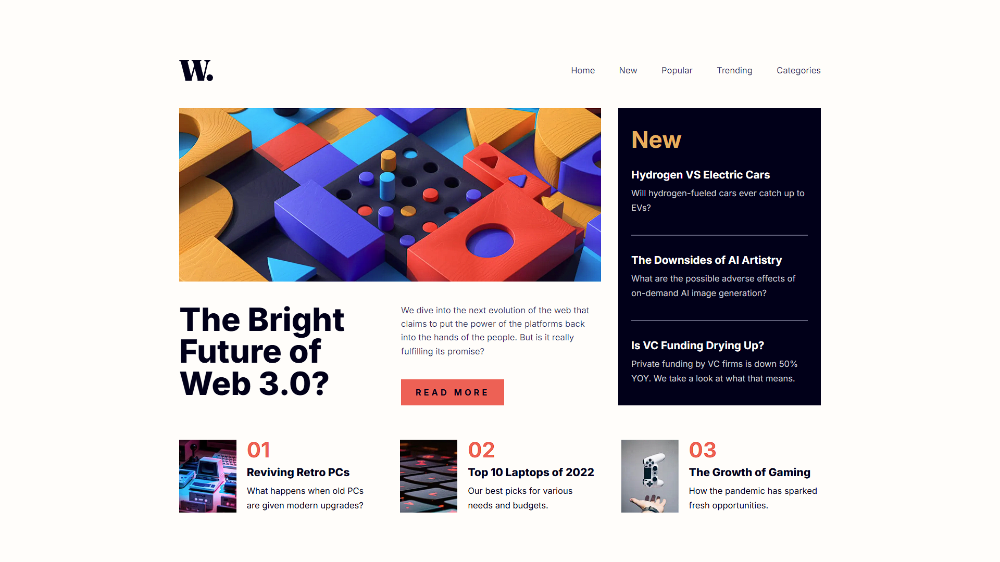

# Frontend Mentor - News homepage solution

This is a solution to the [News homepage challenge on Frontend Mentor](https://www.frontendmentor.io/challenges/news-homepage-H6SWTa1MFl). Frontend Mentor challenges help you improve your coding skills by building realistic projects.

## Table of contents

- [Frontend Mentor - News homepage solution](#frontend-mentor---news-homepage-solution)
  - [Table of contents](#table-of-contents)
  - [Overview](#overview)
    - [Screenshot](#screenshot)
    - [Links](#links)
  - [Built with](#built-with)

**Note: Delete this note and update the table of contents based on what sections you keep.**

## Overview

### Screenshot

### Links

- [Solution URL](https://www.frontendmentor.io/solutions/news-homepage-landing-page-xe_5d1u7re)
- [Live Site URL](https://ione-newshomepage.vercel.app/)

## Built with

- HTML5 markup
- CSS (grid, flexbox)
- [React](https://reactjs.org/) - JS library
- [Next.js](https://nextjs.org/) - React framework
